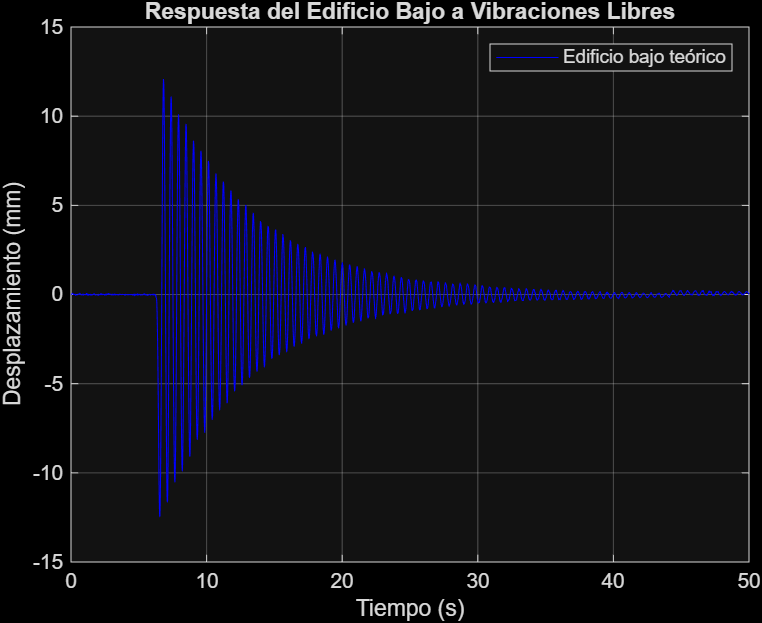
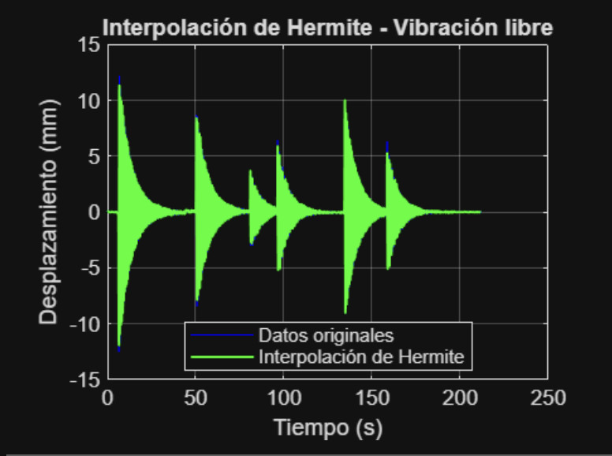
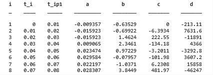
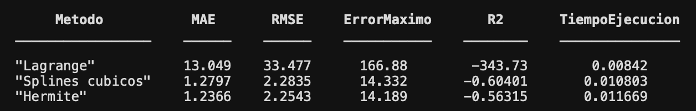
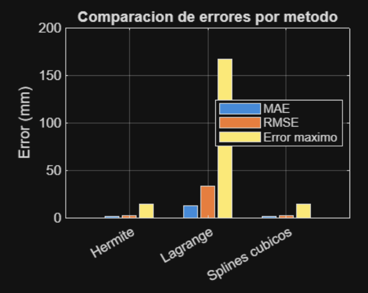

# Introducción

El estudio de las vibraciones es fundamental en la ingeniería civil y en
la dinámica estructural. Las estructuras reales, como edificios,
puentes, torres y elementos mecánicos, están sometidas a cargas
dinámicas producidas por sismos, viento, tránsito o maquinaria. Estas
acciones pueden generar movimientos oscilatorios que deben analizarse
con cuidado para garantizar la seguridad y el buen desempeño de la
estructura [@chopra2020; @rao2017]. Conocer la forma en que vibra un
sistema permite estimar desplazamientos máximos, identificar frecuencias
naturales y prevenir fenómenos no deseados, como la resonancia.

Dentro de este campo, un caso de especial interés es la vibración libre.
Este tipo de movimiento ocurre cuando un sistema dinámico se separa de
su posición de equilibrio y luego se deja oscilar sin la acción de
fuerzas externas. La respuesta en vibración libre permite observar
propiedades propias del sistema, como su frecuencia natural y su nivel
de amortiguamiento. Estas propiedades no dependen directamente de la
excitación aplicada, por lo que pueden entenderse como una huella
dinámica del sistema estructural [@rao2017; @chopra2020].

Desde el punto de vista teórico, la vibración libre puede describirse
mediante ecuaciones diferenciales ordinarias. Sin embargo, en
aplicaciones prácticas la respuesta del sistema suele obtenerse mediante
instrumentación, por ejemplo con acelerómetros, sensores de
desplazamiento o registros de ensayos. Estos equipos entregan la
información en forma de datos discretos; es decir, no se cuenta con una
función continua del movimiento, sino con un conjunto finito de
mediciones tomadas en instantes específicos. Esta forma de obtener los
datos hace necesario utilizar métodos numéricos que permitan
reconstruir, de manera aproximada, el movimiento continuo asociado al
fenómeno observado [@chapra2015; @burden2017].

La interpolación atiende precisamente esta necesidad. A partir de un
conjunto de pares ordenados de tiempo y respuesta, se construye una
función aproximada que pasa por los puntos conocidos y que permite
estimar la respuesta en instantes intermedios. Así, la interpolación
conecta la información discreta medida con una representación continua
del movimiento, lo cual facilita tareas posteriores como la estimación
de velocidades, la identificación de máximos y mínimos, o el cálculo de
cruces por cero [@burden2017].

Los métodos de interpolación, sin embargo, no presentan el mismo
comportamiento frente a un mismo conjunto de datos. La interpolación
polinómica global de Lagrange, los splines cúbicos definidos por tramos
y la interpolación de Hermite, que incorpora información sobre las
derivadas, poseen ventajas y limitaciones diferentes en términos de
precisión, suavidad, estabilidad numérica y costo computacional.
Comparar estos tres métodos resulta pertinente en el análisis de
vibraciones, ya que la aproximación obtenida no solo debe ajustarse a
los datos, sino también conservar una forma físicamente coherente con el
carácter oscilatorio del movimiento [@chapra2015; @deboor2001].

El objetivo de este trabajo es estudiar y comparar la interpolación de
Lagrange, los splines cúbicos y la interpolación de Hermite como
herramientas para aproximar el movimiento de vibración libre de un
sistema dinámico a partir de una base de datos discreta. En este informe
se presentan el desarrollo conceptual y la metodología del proyecto,
mientras que todos los procedimientos numéricos se implementan y
ejecutan en MATLAB.

# Planteamiento del problema

Cuando se registra experimental o numéricamente el movimiento de
vibración libre de un sistema dinámico, la información disponible se
expresa como un conjunto finito de pares ordenados $(t_i, x_i)$, donde
$t_i$ corresponde al tiempo de medición y $x_i$ a la respuesta del
sistema, ya sea desplazamiento o aceleración, en ese instante. Esta
representación discreta no permite evaluar directamente el movimiento en
tiempos intermedios ni estudiar con suficiente detalle el comportamiento
continuo del sistema.

Además, no siempre en un sismo se logran registrar todos los datos, ya
sea por fallas en los instrumentos, o por la destrucción de los mismos.
Por ejemplo, los acelerómetros necesitan cierta amplitud de movimiento
para activarse, por lo que no se registran los datos previo a este
momento [@suarez2020]. Hay muchos otros casos como este, en el que hay
una pérdida de datos, por lo que, es necesario tener alguna forma de
conocer el comportamiento de un edificio, a partir de la información en
ciertos puntos.

Por esta razón, se requiere reconstruir a partir de los datos discretos
una función aproximada $p(t)$ que represente el movimiento dentro del
intervalo de análisis. Existen distintos métodos de interpolación para
realizar esta tarea, pero cada uno posee características propias. Por
ello, no resulta inmediato determinar cuál ofrece la representación más
adecuada del movimiento de vibración libre para una base de datos
específica.

El problema abordado en este trabajo puede formularse de la siguiente
manera: ¿cuál de los métodos de interpolación ---Lagrange, splines
cúbicos o Hermite--- representa con mayor fidelidad y estabilidad el
movimiento de vibración libre de un sistema dinámico a partir de un
conjunto de datos discretos, considerando criterios de error, suavidad,
estabilidad numérica, costo computacional e interpretabilidad física?

# Objetivos

## Objetivo general

Aproximar el movimiento de vibración libre de un sistema dinámico en
MATLAB, con los métodos de interpolación de Lagrange, splines cúbicos e
interpolación de Hermite.

## Objetivos específicos

1.  Describir el fundamento teórico de la vibración libre en sistemas
    dinámicos de un grado de libertad y su representación discreta.

2.  Formular matemáticamente los métodos de interpolación de Lagrange,
    splines cúbicos y Hermite.

3.  Implementar en MATLAB los tres métodos de interpolación a partir de
    los datos disponibles en el repositorio del proyecto.

4.  Generar, mediante MATLAB, las gráficas comparativas de las
    aproximaciones obtenidas con cada método.

5.  Calcular, mediante MATLAB, métricas de error y otros criterios de
    comparación entre los métodos.

6.  Determinar cuál método representa con mayor fidelidad el movimiento
    de vibración libre del sistema analizado.

# Marco teórico

## Vibración libre en sistemas dinámicos

Un sistema dinámico de un grado de libertad puede modelarse mediante una
masa $m$, un elemento de rigidez $k$ y un mecanismo de amortiguamiento
de coeficiente $c$. Cuando el sistema oscila sin la acción de fuerzas
externas, su comportamiento se describe mediante la ecuación diferencial
ordinaria de segundo orden [@rao2017; @chopra2020]:

$$\begin{equation}
    m\,\ddot{x}(t) + c\,\dot{x}(t) + k\,x(t) = 0,
    \label{eq:vibracion_amortiguada}
\end{equation}$$

donde:

- $m$ es la masa del sistema,

- $c$ es el coeficiente de amortiguamiento,

- $k$ es la rigidez del sistema,

- $x(t)$ es el desplazamiento,

- $\dot{x}(t)$ es la velocidad,

- $\ddot{x}(t)$ es la aceleración.

En el caso ideal sin amortiguamiento ($c = 0$), la ecuación
[\[eq:vibracion_amortiguada\]](#eq:vibracion_amortiguada){reference-type="eqref"
reference="eq:vibracion_amortiguada"} se reduce a:

$$\begin{equation}
    m\,\ddot{x}(t) + k\,x(t) = 0,
    \label{eq:vibracion_no_amortiguada}
\end{equation}$$

cuya solución es un movimiento armónico simple caracterizado por la
*frecuencia natural*:

$$\begin{equation}
    \omega_n = \sqrt{\dfrac{k}{m}}.
    \label{eq:frecuencia_natural}
\end{equation}$$

Cuando existe amortiguamiento, conviene introducir la *razón de
amortiguamiento*:

$$\begin{equation}
    \zeta = \dfrac{c}{2\sqrt{k\,m}},
    \label{eq:razon_amortiguamiento}
\end{equation}$$

de modo que, en el régimen subamortiguado ($0 < \zeta < 1$), la
respuesta de vibración libre adopta la forma de una oscilación que decae
exponencialmente [@chopra2020]:

$$\begin{equation}
    x(t) = e^{-\zeta \omega_n t}
    \left[ A \cos(\omega_d t) + B \sin(\omega_d t) \right],
    \qquad \omega_d = \omega_n \sqrt{1 - \zeta^2}.
    \label{eq:solucion_subamortiguada}
\end{equation}$$

Aunque el modelo teórico descrito por las ecuaciones anteriores permite
caracterizar el movimiento de forma analítica, en la práctica la
respuesta del sistema se conoce a través de mediciones discretas. Por
ello, es necesario recurrir a métodos numéricos para reconstruir el
movimiento continuo a partir de tales datos [@chapra2015; @burden2017].

## Representación discreta del movimiento

La base de datos del proyecto está conformada por un conjunto finito de
pares ordenados:

$$\begin{equation}
    (t_i, x_i), \qquad i = 0, 1, \dots, n,
    \label{eq:datos_discretos}
\end{equation}$$

donde $t_i$ representa el tiempo y $x_i$ la respuesta del sistema en ese
instante (desplazamiento o, según el caso, aceleración).

El objetivo numérico consiste en construir una función aproximada:

$$\begin{equation}
    p(t) \approx x(t),
    \label{eq:aproximacion}
\end{equation}$$

que represente el movimiento del sistema en el intervalo de análisis y
permita estimar la respuesta en instantes no medidos. La calidad de esta
aproximación depende del método de interpolación empleado, de la
distribución de los nodos y del nivel de ruido presente en los datos.

## Interpolación polinómica de Lagrange

La interpolación de Lagrange construye un único polinomio de grado a lo
sumo $n$ que pasa exactamente por los $n+1$ puntos conocidos
[@burden2017; @chapra2015]. El polinomio interpolante se expresa como:

$$\begin{equation}
    P_n(t) = \sum_{i=0}^{n} x_i\, L_i(t),
    \label{eq:lagrange}
\end{equation}$$

donde $L_i(t)$ son los polinomios base de Lagrange, definidos como:

$$\begin{equation}
    L_i(t) = \prod_{\substack{j=0 \\ j \neq i}}^{n}
    \frac{t - t_j}{t_i - t_j}.
    \label{eq:base_lagrange}
\end{equation}$$

Cada polinomio base satisface la propiedad $L_i(t_j) = \delta_{ij}$, de
modo que $P_n(t_i) = x_i$ en todos los nodos. El error de interpolación,
cuando la función subyacente es suficientemente suave, puede acotarse
mediante una expresión que involucra la $(n+1)$-ésima derivada de la
función [@burden2017].

Entre sus ventajas se cuenta su formulación directa y su exactitud en
los nodos. Sin embargo, la interpolación polinómica global presenta una
limitación importante: al aumentar el número de nodos, especialmente si
están igualmente espaciados, el polinomio puede desarrollar oscilaciones
espurias de gran amplitud cerca de los extremos del intervalo, fenómeno
conocido como *fenómeno de Runge* [@chapra2015]. Esta inestabilidad
puede distorsionar la representación de un movimiento de vibración libre
cuando se emplean muchos puntos.

## Splines cúbicos

Los splines cúbicos evitan las oscilaciones del polinomio global
aproximando la función por tramos mediante polinomios de grado tres. En
cada subintervalo $[t_i, t_{i+1}]$ se define un polinomio de la forma
[@deboor2001; @burden2017]:

$$\begin{equation}
    S_i(t) = a_i + b_i (t - t_i) + c_i (t - t_i)^2 + d_i (t - t_i)^3,
    \qquad t_i \leq t \leq t_{i+1}.
    \label{eq:spline}
\end{equation}$$

Los coeficientes $a_i, b_i, c_i, d_i$ se determinan imponiendo
condiciones de continuidad en los nodos interiores:

- **Continuidad de la función:** el spline debe ser continuo, es decir,
  los tramos coinciden en los nodos.

- **Continuidad de la primera derivada:** las pendientes de los tramos
  adyacentes coinciden en los nodos.

- **Continuidad de la segunda derivada:** la curvatura es continua a
  través de los nodos.

Estas condiciones, junto con condiciones de frontera adecuadas (por
ejemplo, spline natural, en el que la segunda derivada se anula en los
extremos, o spline sujeto, en el que se imponen las pendientes en los
extremos), conducen a un sistema lineal que define los coeficientes. El
resultado es una curva suave de clase $C^2$ que, en general, es más
estable que un único polinomio global de alto grado [@deboor2001], lo
que la hace especialmente adecuada para representar señales oscilatorias
como las de vibración libre.

## Interpolación de Hermite

La interpolación de Hermite utiliza no solo los valores de la función en
los nodos, sino también los valores de su derivada [@burden2017]. Si en
cada nodo se conocen o se aproximan las velocidades $\dot{x}_i$, es
posible construir interpolantes que respeten simultáneamente la posición
y la pendiente del movimiento. Esto resulta físicamente significativo en
el estudio de vibraciones, donde la velocidad tiene un sentido
cinemático directo.

En el intervalo $[t_i, t_{i+1}]$, el interpolante cúbico de Hermite
puede expresarse mediante funciones base como:

$$\begin{equation}
    H_i(t) = h_{00}(s)\,x_i
    + h_{10}(s)\,(t_{i+1} - t_i)\,\dot{x}_i
    + h_{01}(s)\,x_{i+1}
    + h_{11}(s)\,(t_{i+1} - t_i)\,\dot{x}_{i+1},
    \label{eq:hermite}
\end{equation}$$

donde el parámetro normalizado es:

$$\begin{equation}
    s = \frac{t - t_i}{t_{i+1} - t_i},
    \label{eq:hermite_s}
\end{equation}$$

y las funciones base de Hermite son:

$$\begin{align}
    h_{00}(s) &= 2s^3 - 3s^2 + 1, \label{eq:h00}\\
    h_{10}(s) &= s^3 - 2s^2 + s,  \label{eq:h10}\\
    h_{01}(s) &= -2s^3 + 3s^2,    \label{eq:h01}\\
    h_{11}(s) &= s^3 - s^2.       \label{eq:h11}
\end{align}$$

Si las derivadas $\dot{x}_i$ no están disponibles directamente en la
base de datos, pueden aproximarse numéricamente mediante diferencias
finitas a partir de los valores de $x_i$ y $t_i$ [@chapra2015]. La
interpolación de Hermite produce una curva suave que conserva la
información de la pendiente, lo que permite representar de manera
coherente los tramos crecientes y decrecientes del movimiento
oscilatorio.

## Criterios de comparación entre métodos

Para comparar los tres métodos de interpolación se proponen los
siguientes criterios [@chapra2015; @burden2017]:

- **Error respecto a los datos conocidos:** discrepancia entre la
  aproximación y los valores medidos (por ejemplo, error cuadrático
  medio o error máximo absoluto), evaluada en puntos de control.

- **Suavidad de la curva:** grado de continuidad y ausencia de
  oscilaciones artificiales en la representación.

- **Estabilidad numérica:** sensibilidad del método al número de nodos,
  a su distribución y a la presencia de ruido en los datos.

- **Representación de características físicas:** capacidad de reproducir
  máximos, mínimos y cruces por cero del movimiento.

- **Costo computacional:** esfuerzo requerido para construir y evaluar
  el interpolante.

- **Interpretabilidad física:** coherencia del resultado con el
  comportamiento esperado de un sistema en vibración libre.

## Metodo de comparación de resultados por analisís MAE y MSRT

- **MAE (Error absoluto medio):** representa el promedio de lo errores
  absolutos entre los valores obtenidos y los reales. En esta métrica,
  todos los errores pesan lo mismo, sin importar su tamaño. Para
  calcularlo, se utiliza la siguiente fórmula [@chai2014]:
  $$\begin{equation}
  MAE = \frac{1}{n}\sum_{i=1}^{n} \left| y_i - \hat{y}_i \right|
  \end{equation}$$

- **MSRT (Raíz del error cuadrático medio):** representa la raíz
  cuadrada del promedio de los errores al cuadrado. Al elevar al
  cuadrado cada error absoluto, esta métrica está hecha para castigar
  los errores grandes. Para calcularlo, se utiliza la siguiente fórmula
  [@chai2014]:

  $$\begin{equation}
  RMSE = \sqrt{\frac{1}{n}\sum_{i=1}^{n} \left( y_i - \hat{y}_i \right)^2}
  \end{equation}$$

# Metodología

## Descripción general de la base de datos

Con el fin de lograr la replicación del experimento así como la
veracidad del mismo, se pone a disposición del lector el acceso a los
datos, instrucciones y todo aquel documento que resulte relevante.

La base de datos del proyecto está disponible en el repositorio público
de GitHub:

::: center
<https://github.com/adrianix360/respositorio_proyecto_analisis>
:::

Dicha base contiene los registros del movimiento de vibración libre del
sistema analizado, organizados como pares ordenados de tiempo y
respuesta, conforme a la expresión
[\[eq:datos_discretos\]](#eq:datos_discretos){reference-type="eqref"
reference="eq:datos_discretos"}. La descripción detallada del formato,
las unidades y la cantidad de registros se completará una vez revisado
el contenido del repositorio.

## Preparación de los datos

Antes de aplicar los métodos de interpolación, los datos se cargan y se
organizan en MATLAB. Esta etapa comprende:

1.  Carga de la base de datos desde el repositorio de GitHub.

2.  Identificación de las variables relevantes (tiempo y desplazamiento,
    o tiempo y aceleración, según el contenido de la base).

3.  Limpieza y ordenamiento de los datos, debido a que los datos
    utilizados presentan multiples movimientos que producen vibración,
    solo se utiliza la primera vibración presente en la toma de datos..

4.  Selección del intervalo de análisis y, cuando corresponda, de los
    nodos que se emplearán para construir las ecuaciones de
    interpolador.

## Aplicación de la interpolación de Lagrange

Se construye el polinomio interpolante de Lagrange definido por las
ecuaciones [\[eq:lagrange\]](#eq:lagrange){reference-type="eqref"
reference="eq:lagrange"} y
[\[eq:base_lagrange\]](#eq:base_lagrange){reference-type="eqref"
reference="eq:base_lagrange"} a partir de los nodos seleccionados. La
construcción de los polinomios base, el ensamblaje del polinomio
interpolante y su evaluación sobre una malla fina de tiempo se realizan
en MATLAB.

## Aplicación de splines cúbicos

Se determinan los coeficientes de los splines cúbicos definidos por la
ecuación [\[eq:spline\]](#eq:spline){reference-type="eqref"
reference="eq:spline"}, imponiendo las condiciones de continuidad
descritas en el marco teórico y las condiciones de frontera
seleccionadas. El planteamiento y la resolución del sistema lineal
correspondiente, así como la evaluación del spline resultante, se
efectúan en MATLAB.

## Aplicación de la interpolación de Hermite

Se construye el interpolante cúbico de Hermite según las ecuaciones
[\[eq:hermite\]](#eq:hermite){reference-type="eqref"
reference="eq:hermite"}--[\[eq:h11\]](#eq:h11){reference-type="eqref"
reference="eq:h11"}. Cuando las derivadas $\dot{x}_i$ no estén
disponibles en la base de datos, se aproximan mediante diferencias
finitas. La estimación de las derivadas, el ensamblaje del interpolante
y su evaluación se llevan a cabo en MATLAB.

## Comparación de resultados

Una vez obtenidas las tres aproximaciones, se comparan entre sí y
respecto a los datos originales empleando los criterios definidos en el
marco teórico. Esta etapa incluye:

1.  Generación de gráficas comparativas de las aproximaciones frente a
    los datos medidos.

2.  Cálculo de métricas de error y de otros criterios de comparación.

3.  Discusión del método que representa con mayor fidelidad el
    movimiento de vibración libre.

## Implementación computacional en MATLAB

Todos los procedimientos numéricos del proyecto se implementan mediante
scripts en MATLAB, tomando como entrada los datos disponibles en el
repositorio de GitHub. En particular, MATLAB se encarga de:

1.  La carga y el procesamiento de la base de datos.

2.  La selección de los nodos de interpolación.

3.  La construcción de los interpolantes de Lagrange, splines cúbicos y
    Hermite.

4.  El cálculo de los coeficientes correspondientes.

5.  La evaluación de cada método sobre el intervalo de análisis.

6.  La generación de las gráficas.

7.  El cálculo de los errores y las métricas comparativas.

8.  La comparación entre los tres métodos.

De esta manera, el documento LaTeX no contiene desarrollos numéricos
extensos ni cálculos manuales paso a paso. Los resultados numéricos,
gráficas y tablas comparativas se generan en MATLAB y posteriormente se
incorporan a este documento en los espacios reservados. Los scripts
utilizados se adjuntarán en el repositorio de GitHub del proyecto.

# Resultados esperados

Se espera obtener, para cada método de interpolación, una aproximación
del movimiento de vibración libre del sistema en el intervalo de
análisis. A partir de las gráficas y de las métricas de error generadas
en MATLAB, se prevé:

- Que la interpolación de Lagrange ajuste exactamente los nodos pero
  pueda presentar oscilaciones espurias al aumentar el número de puntos.

- Que los splines cúbicos produzcan una curva suave y estable, adecuada
  para representar el carácter oscilatorio del movimiento.

- Que la interpolación de Hermite, al incorporar la información de las
  derivadas, reproduzca de forma coherente la pendiente del movimiento.

La comparación cuantitativa y cualitativa permitirá identificar el
método más adecuado para representar el movimiento de vibración libre
del sistema analizado.

A continuación se adjunta la gráfica obtenida con los datos disponibles
en el repositorio. Este gráfico se utilizará para comparar la ecuación
teórica que se obtendrá por medio del análisis de algunos valores
$(t_i,x_i)$

<figure id="fig:datos_Yi" data-latex-placement="H">

<figcaption>Gráfico resultado de los datos obtenidos por la mesa
vibratoria</figcaption>
</figure>

# Resultados obtenidos

## Ecuación teórica

Por medio del siguiente código se obtuvieron los valores necesarios para
formular una ecuación que describe la vibración libre, la cual se
graficó y comparó con la ecuación obtenida en la figura
[1](#fig:datos_Yi){reference-type="ref" reference="fig:datos_Yi"}
Entradas:\
$T_d$=Periodo natural amortiguado $[s]$\
$\xi$=Índice de amortiguamiento\
$\omega_n$=Frecuencia circular natural $[rad/s]$\
$\omega_d$=Frecuencia circular amortiguada $[rad/s]$\

``` {.matlab language="Matlab"}
function [A1,xi,omega_n,omega_d,T_n] = obtenerModelo(t,y)%funcion generica que recibe un vector tiempo y un vector desplazamiento y devuelve todas las variables que estan en la llave


[picos,local] = findpeaks(y,t,'MinPeakHeight',0.5);%localiza las tres primeras crestas para obtener un valor del periodo promedio

primeros_tiempos = local(1:3);

T1 = primeros_tiempos(2)-primeros_tiempos(1);
T2 = primeros_tiempos(3)-primeros_tiempos(2);

T_d = mean([T1 T2])%periodo natural promedio

% Frecuencia amortiguada
omega_d = 2*pi/T_d


[A1,idx] = max(y);
Amp_max=A1%amplitud maxima
tmax = t(idx);

t_objetivo = tmax + T_n;%periodo T+1

[~,idx2] = min(abs(t-t_objetivo));

A2 = y(idx2);%segunda cresta

% Decremento logaritmico
delta = log(A1/A2)

xi = delta/sqrt(4*pi^2 + delta^2)

% Frecuencia natural
omega_n = omega_d/sqrt(1-xi^2)

end

```

Con los datos anteriores se construye por medio del siguiente código la
ecuación experimental: $$\begin{equation}
    12.1008e^{-0.0139\cdot11.4251\cdot t}sen(11.4240t)
\end{equation}$$

``` {.matlab language="Matlab"}
function x = vibracion(t,A,omega_n,omega_d,xi)%creacion de la ecuacion teorica a partir de los datos experimentales

x = A.*exp(-xi.*omega_n.*t).*sin(omega_d.*t);

end

t = libre(:,1);%vector de tiempo (s)
y = libre(:,3);%vector de desplazamiento del edificio bajo (mm)

%t = libre(:,1);%vector de tiempo (s)
%y = libre(:,4);%vector de desplazamiento del edificio alto (mm)

[A1,xi,omega_n,omega_d,T_d] = obtenerModelo(t,y);%calcula variables

y_modelo = vibracion(t,A1,omega_n,omega_d,xi);%crea la curva verde
```

Con el siguiente código se colocan ambas gráficas (la original con los
datos medidos y la propuesta por la ecuación experimental):

``` {.matlab language="Matlab"}
figure
plot(t(1:3000),y(1:3000),'-b')
hold on
plot(t(1:3000),vibracion(t(1:3000),A1,omega_n,omega_d,xi),'-g')
hold off
legend('Edificio bajo teorico','Edificio bajo experimental')
xlabel('Tiempo (s)')
ylabel('Desplazamiento (mm)')
title('Respuesta del Edificio Bajo a Vibraciones Libres');
grid on;
```

En el siguiente gráfico la gráfica verde es el resultado de la ecuación
experimental y la gráfica azul corresponde a los $(t_i,x_i)$ medidos en
campo. Es importante aclarar que se observa un desfase debido a una
posible excitación del edificio antes de comenzar la medición de sus
datos, por lo que ambas curvas no presentan el mismo inicio.

<figure id="fig:Gráfico2" data-latex-placement="H">

<figcaption>Gráfico experimental vs gráfico teórico</figcaption>
</figure>

## Polinomio interpolador de Hermite

Para poder encontrar el polinomio interpolador de Hermite, primero se
procedió a realizar una limpieza de datos para que, posteriormente, se
puedan encontrar las derivadas de la posición con respecto al tiempo.
Estas se obtuvieron mediante el diferencias finitas adelante en el
primer punto, atrás en el ultimo punto y centrada en los puntos
interiores. Luego, utilizando la ecuaciones (11)-(16), se calculó el
polinomio interpolador de Hermite. Las siguientes son las variables
utilizadas en el código de Matlab:\
Entradas:\
t: vector de tiempos\
x: vector de respuesta del sistema (desplazamiento, etc.)\
npuntos: cantidad de puntos de la malla fina de evaluacion\
Salidas:\
tfino: malla fina de tiempo\
xhermite: valores interpolados por Hermite\
dxdt: derivadas aproximadas en los nodos\

``` {.matlab language="Matlab"}
function [t_fino, x_hermite, dxdt] = hermite_vibracion(t, x, n_puntos)
% HERMITE_VIBRACION  Interpolacion cubica de Hermite por tramos.

    t = t(:);
    x = x(:);

    % --- Ordenar por tiempo ---
    [t, idx] = sort(t);
    x = x(idx);

    % --- Eliminar tiempos repetidos (y advertir) ---
    n_antes = length(t);
    [t, iu] = unique(t);     % t queda ordenado y sin repeticiones
    x = x(iu);
    if length(t) < n_antes
        warning('hermite_vibracion:duplicados', ...
            'Se eliminaron %d valores de tiempo repetidos.', n_antes - length(t));
    end

    n = length(t);
    if n < 2
        error('Se necesitan al menos 2 puntos para interpolar.');
    end

    % --- Derivadas numericas en los nodos (diferencias finitas) ---
    dxdt = zeros(n, 1);
    dxdt(1) = (x(2) - x(1)) / (t(2) - t(1));             % adelante
    dxdt(n) = (x(n) - x(n-1)) / (t(n) - t(n-1));         % atras
    for i = 2:n-1
        dxdt(i) = (x(i+1) - x(i-1)) / (t(i+1) - t(i-1)); % centrada
    end

    % --- Malla fina de evaluacion ---
    t_fino = linspace(t(1), t(n), n_puntos)';
    x_hermite = zeros(size(t_fino));

    % --- Evaluacion del interpolante de Hermite por tramos ---
    for k = 1:n-1
        ti  = t(k);
        ti1 = t(k+1);
        hi  = ti1 - ti;                 % h_i = t_{i+1} - t_i

        % Puntos de la malla que caen en el intervalo [ti, ti1]
        if k < n-1
            sel = find(t_fino >= ti & t_fino <  ti1);
        else
            sel = find(t_fino >= ti & t_fino <= ti1);   % incluye el extremo final
        end

        s = (t_fino(sel) - ti) / hi;    % s = (t - t_i) / h_i

        % Funciones base de Hermite
        h00 =  2*s.^3 - 3*s.^2 + 1;
        h10 =      s.^3 - 2*s.^2 + s;
        h01 = -2*s.^3 + 3*s.^2;
        h11 =      s.^3 -   s.^2;

        % H_i(t) = h00*x_i + h10*h_i*x'_i + h01*x_{i+1} + h11*h_i*x'_{i+1}
        x_hermite(sel) = h00*x(k)   + h10*hi*dxdt(k) ...
                       + h01*x(k+1) + h11*hi*dxdt(k+1);
    end
end
```

Finalmente, se decidió utilizar 3000 nodos para la construcción del
polinomio interpolador debido a varias razones. La precisión que se
obtuvo con esta cantidad de puntos es significativamente alta, por lo
que el uso de mayor cantidad de nodos solo resulta en un costo
computacional mayor sin ningún beneficio a cambio. Por lo tanto, su
reducido costo computacional y la suavidad en la curva del interpolador
obtenido justifican la cantidad de nodos implementados. A continuación
se presenta la gráfica del polinomio en contraste con el movimiento de
la estructura.

``` {.matlab language="Matlab"}
libre = readmatrix('Datos/vibracion_libre.txt');

t = libre(:,1);   % tiempo (s)
y = libre(:,3);   % desplazamiento (mm)

% Opcional: usar solo el primer tramo, como en el script base del proyecto.
% t = t(1:3000);  y = y(1:3000);

%% Calculo de derivadas numericas y evaluacion del interpolante
n_puntos = 3000;            

% Resolucion de la malla fina
[t_fino, x_hermite, dxdt] = hermite_vibracion(t, y, n_puntos);

%% Grafica de resultados
figure
plot(t, y, '-b')                                   % datos originales
hold on
plot(t_fino, x_hermite, '-g', 'LineWidth', 1.2)    % interpolacion de Hermite
hold off
legend('Datos originales', 'Interpolacion de Hermite', 'Location', 'best')
xlabel('Tiempo (s)')
ylabel('Desplazamiento (mm)')
title('Interpolacion de Hermite - Vibracion libre')
grid on
```

<figure id="fig:Gráfico3" data-latex-placement="H">

<figcaption>Comparación del polinomio interpolador de Hermite con el
movimiento de la estructura</figcaption>
</figure>

## Resultados obtenidos con el método de splines cúbicos

El código de MATLAB para el método de splines cúbicos ordena primero los
datos de tiempo y desplazamiento, elimina tiempos repetidos y calcula
los anchos $h_i=t_{i+1}-t_i$ de cada intervalo. Luego construye un
sistema tridiagonal para obtener los coeficientes $c_i$, asociados con
la curvatura del spline. Este sistema se resuelve mediante el algoritmo
de Thomas, que es eficiente para matrices tridiagonales. Finalmente, se
calculan los coeficientes $a_i$, $b_i$ y $d_i$, y se evalúa el spline en
una malla fina de tiempo.

``` {.matlab language="Matlab"}

t = libre(:,1);   
y = libre(:,3);   

n_puntos = 3000;                                  
[t_fino, x_spline, coeficientes] = spline_cubico_vibracion(t, y, n_puntos);
disp(head(coeficientes, 8));

%% Grafica de resultados
figure
plot(t, y, '-b')                                  
hold on
plot(t_fino, x_spline, '-g', 'LineWidth', 1.2)     
hold off
legend('Datos originales', 'Spline cubico natural', 'Location', 'best')
xlabel('Tiempo (s)')
ylabel('Desplazamiento (mm)')
title('Splines cubicos - Vibracion libre')
grid on

    % --- Asegurar vectores columna ---
    t = t(:);
    x = x(:);

    % --- Ordenar por tiempo ---
    [t, idx] = sort(t);
    x = x(idx);

    % --- Eliminar tiempos repetidos (y advertir) ---
    n_antes = length(t);
    [t, iu] = unique(t);    
    x = x(iu);
    if length(t) < n_antes
        warning('spline_cubico:duplicados', ...
            'Se eliminaron %d valores de tiempo repetidos.', n_antes - length(t));
    end

    N = length(t);          
    if N < 3
        error('Se necesitan al menos 3 puntos para un spline cubico.');
    end

    % --- Anchos de los intervalos ---
    h = diff(t);             % h(i) = t(i+1) - t(i),  i = 1..N-1

    % ----------------------------------------------------------------
    % Construccion del sistema tridiagonal para los coeficientes c
    % (c_i = S''(t_i)/2).  Filas 1 y N imponen el spline natural.
    % ----------------------------------------------------------------
    sub  = zeros(N,1);   % subdiagonal  (coef. de c_{i-1})
    diag = zeros(N,1);   % diagonal     (coef. de c_i)
    sup  = zeros(N,1);   % superdiagonal(coef. de c_{i+1})
    d    = zeros(N,1);   % lado derecho

    % Condiciones naturales:  c_1 = 0  y  c_N = 0
    diag(1) = 1;   d(1) = 0;
    diag(N) = 1;   d(N) = 0;

    % Ecuaciones interiores  i = 2..N-1
    for i = 2:N-1
        sub(i)  = h(i-1);
        diag(i) = 2*(h(i-1) + h(i));
        sup(i)  = h(i);
        d(i)    = 3*( (x(i+1)-x(i))/h(i) - (x(i)-x(i-1))/h(i-1) );
    end

    % --- Resolucion del sistema tridiagonal (algoritmo de Thomas) ---
    % Eliminacion hacia adelante
    for i = 2:N
        w       = sub(i)/diag(i-1);
        diag(i) = diag(i) - w*sup(i-1);
        d(i)    = d(i)    - w*d(i-1);
    end
    % Sustitucion hacia atras
    c = zeros(N,1);
    c(N) = d(N)/diag(N);
    for i = N-1:-1:1
        c(i) = (d(i) - sup(i)*c(i+1)) / diag(i);
    end

    % ----------------------------------------------------------------
    % Calculo de coeficientes a, b, d de cada tramo  i = 1..N-1
    % ----------------------------------------------------------------
    a = zeros(N-1,1);
    b = zeros(N-1,1);
    dd = zeros(N-1,1);  
    for i = 1:N-1
        a(i)  = x(i);
        b(i)  = (x(i+1)-x(i))/h(i) - h(i)/3*(2*c(i) + c(i+1));
        dd(i) = (c(i+1) - c(i)) / (3*h(i));
    end
    c_tramo = c(1:N-1);  

    % --- Tabla de coeficientes ---
    coeficientes = table((1:N-1)', t(1:N-1), t(2:N), a, b, c_tramo, dd, ...
        'VariableNames', {'i','t_i','t_ip1','a','b','c','d'});

    % ----------------------------------------------------------------
    % Evaluacion del spline en la malla fina
    % ----------------------------------------------------------------
    t_fino   = linspace(t(1), t(N), n_puntos)';
    x_spline = zeros(size(t_fino));

    for k = 1:N-1
        ti  = t(k);
        ti1 = t(k+1);

        % Puntos de la malla que caen en el intervalo [ti, ti1]
        if k < N-1
            sel = find(t_fino >= ti & t_fino <  ti1);
        else
            sel = find(t_fino >= ti & t_fino <= ti1);  
        end

        dt = t_fino(sel) - ti;   % (t - t_i)
        x_spline(sel) = a(k) + b(k)*dt + c_tramo(k)*dt.^2 + dd(k)*dt.^3;
    end
end
```

{#fig:placeholder width="50%"}

El comportamiento obtenido con los splines cúbicos es adecuado para el
análisis de vibraciones libres porque el método produce una curva
continua y suave. Esta suavidad es relevante en ingeniería civil, ya que
el desplazamiento estructural no debería representarse mediante una
función con cambios bruscos o quiebres artificiales entre mediciones
consecutivas. Al imponer continuidad de la función, de la primera
derivada y de la segunda derivada, el spline genera una representación
compatible con la idea física de un movimiento oscilatorio continuo.

La principal ventaja observada en los splines cúbicos es su estabilidad
numérica. Como el método trabaja por tramos, cada polinomio cúbico solo
representa una parte local de la señal. Esto evita que un error o una
variación en una zona específica afecte de manera exagerada todo el
intervalo. Esta característica marca una diferencia importante respecto
al polinomio de Lagrange, ya que Lagrange construye un único polinomio
global y, por lo tanto, puede amplificar oscilaciones artificiales,
especialmente cerca de los extremos del intervalo.

En la comparación realizada, Lagrange tuvo un MAE de $13.049$ mm y un
RMSE de $33.477$ mm, valores considerablemente superiores a los
obtenidos por splines cúbicos. Esto confirma que, aunque Lagrange puede
ser más rápido computacionalmente, no fue el método más adecuado para
representar la señal de vibración libre. Su error máximo de $166.88$ mm
evidencia la aparición de discrepancias grandes, probablemente asociadas
al fenómeno de Runge y a la dificultad de representar una señal
oscilatoria completa mediante un solo polinomio.

<figure id="fig:coeficientes_spline" data-latex-placement="H">

<figcaption>Primeros coeficientes calculados para los tramos del spline
cúbico natural.</figcaption>
</figure>

Por otro lado, Hermite obtuvo resultados ligeramente mejores que los
splines cúbicos en las métricas de error. Esto se explica porque Hermite
incorpora información de la pendiente, es decir, aproxima la derivada
del desplazamiento con respecto al tiempo. En vibraciones, esa derivada
está relacionada con la velocidad, por lo que el método puede
representar de manera más ajustada los cambios de dirección de la señal.
No obstante, esa ventaja también implica una dependencia adicional: si
las derivadas no se conocen experimentalmente, deben aproximarse por
diferencias finitas. Por esa razón, Hermite puede ser muy preciso, pero
depende de la calidad de esas derivadas aproximadas.

Los splines cúbicos, en cambio, no requieren conocer directamente la
velocidad ni aproximar derivadas externas en cada nodo. El método
calcula la suavidad de la curva a partir de las condiciones internas del
sistema tridiagonal. Esto lo convierte en una alternativa robusta y
conveniente cuando se trabaja con datos experimentales de desplazamiento
en función del tiempo, como ocurre en este proyecto.

Desde el punto de vista del costo computacional, el spline cúbico tuvo
un tiempo de ejecución de $0.010803$ s, mientras que Hermite tuvo
$0.011669$ s y Lagrange $0.008420$ s. Aunque Lagrange fue el más rápido,
su menor tiempo de ejecución no compensa el aumento significativo del
error. En cambio, los splines cúbicos mantienen un costo computacional
bajo y producen una aproximación mucho más estable y físicamente
coherente.

En síntesis, los splines cúbicos representan un equilibrio favorable
entre precisión, estabilidad y sentido físico. Aunque Hermite obtuvo el
menor RMSE, la diferencia con splines fue pequeña. Además, el spline
cúbico natural presentó una curva suave, evitó las oscilaciones grandes
del polinomio global de Lagrange y permitió reconstruir adecuadamente el
comportamiento oscilatorio del sistema. Por ello, para el análisis de
vibraciones libres en ingeniería civil, los splines cúbicos pueden
considerarse una herramienta numérica confiable para aproximar el
movimiento continuo de una estructura a partir de datos discretos.

## Polinomio interpolador de Lagrange

Para obtener el polinomio interpolador de Lagrange, primero se
extrajeron los valores de tiempo y desplazamiento del conjunto de datos.
De esta base de datos, se seleccionan 15 puntos equiespaciados,
cubriendo todo el espacio temporal para no concentrarse en una sola
zona. El código ordena los puntos por tiempo, y garantiza que ninguno
este repetido. Se deben usar pocos nodos para evitar el fenómeno de
Runge. Obteniendo estos nodos iniciales, se crea un vector de 500
tiempos entre el primer y último nodo, para poder crear el polinomio y
graficarlo en una línea continua. Para poder realizar este método, se
utilizaron las siguientes variables:\
Entradas:\
t: vector de tiempos\
x: vector de desplazamiento\
num nodos: cantidad de puntos iniciales extraídos de la base de datos\
n puntos: cantidad de puntos de la malla fina de evaluacion\
\
Salidas:\
t fino: vector de 500 tiempos equiespaciados\
x lagrange: vector de 500 desplazamientos calculados por el polinomio de
Lagrange\
nodos t: vector con los 15 tiempos iniciales\
nodos x: vector con los 15 desplazamientos correspondientes a los
tiempos iniciales\

``` {.matlab language="Matlab"}
t = libre(:,1);
y = libre(:,3);

% num_nodos controla el grado del polinomio (grado = num_nodos - 1).
% n_puntos define cuantos puntos tendra la curva interpolada al graficar.
num_nodos = 15;
n_puntos = 500;


[t_fino, x_lagrange, nodos_t, nodos_x] = lagrange_vibracion(t, y, num_nodos, n_puntos);

% Muestra una tabla con el indice, tiempo y desplazamiento de cada nodo seleccionado, util para verificar la distribucion.
nodos = table((1:length(nodos_t))', nodos_t, nodos_x, ...
    'VariableNames', {'i','t_i','x_i'});
disp(nodos);


function [t_fino, x_lagrange, nodos_t, nodos_x] = lagrange_vibracion(t, x, num_nodos, n_puntos)

    % Asegura vectores columna, ordena por tiempo y elimina duplicados
    t = t(:);
    x = x(:);
    [t, idx] = sort(t);
    x = x(idx);
    n_antes = length(t);
    [t, iu] = unique(t);
    x = x(iu);
    if length(t) < n_antes
        warning('lagrange_vibracion:duplicados', ...
            'Se eliminaron %d valores de tiempo repetidos.', n_antes - length(t));
    end
    N = length(t);

    % Selecciona num_nodos puntos equiespaciados del dataset
    if num_nodos < 2
        num_nodos = 2;
    end
    if N <= num_nodos
        sel = (1:N)';
    else
        sel = unique(round(linspace(1, N, num_nodos)))';
    end
    nodos_t = t(sel);
    nodos_x = x(sel);
    n = length(nodos_t);

    % Avisa si el grado es alto (riesgo de oscilaciones de Runge)
    if n > 15
        warning('lagrange_vibracion:grado_alto', ...
            ['Se usan %d nodos (grado %d). Grados altos pueden causar ', ...
            'oscilaciones y perdida de estabilidad numerica.'], n, n-1);
    end

    % Malla fina donde se evaluara el polinomio.  El polinomio solo se evalua dentro de este rango.
    t_fino = linspace(nodos_t(1), nodos_t(n), n_puntos)';
    x_lagrange = zeros(size(t_fino));

    % Construccion de P(t) = sum_i x_i * L_i(t)

    for i = 1:n
        Li = ones(size(t_fino));
        for j = 1:n
            if j ~= i
                Li = Li .* (t_fino - nodos_t(j)) / (nodos_t(i) - nodos_t(j));
            end
        end
        x_lagrange = x_lagrange + nodos_x(i) * Li;
    end
end
```

Tras haber obtenido estos datos, se puede graficar la función del
polinomio interpolador de Lagrange. La razón principal por la que
utilizaron 500 puntos es para poder obtener una curva suave y continua,
pero sin un costo computacional excesivo. El siguiente código fue el que
se utilizó para crear el gráfico, en el cual, los puntos azules
representan los datos verdaderos medidos en el sismo, la curva verde es
el polinomio interpolador obtenido, y los puntos rojos son los 15 nodos
utilizados inicialmente para calcular el polinomio.

``` {.matlab language="Matlab"}
figure
plot(t, y, '-b') 
hold on
plot(t_fino, x_lagrange, '-g', 'LineWidth', 1.2) 
scatter(nodos_t, nodos_x, 40, 'r', 'filled') 
hold off
legend('Datos originales', 'Interpolacion de Lagrange', 'Nodos', ...
       'Location', 'best')
xlabel('Tiempo (s)')
ylabel('Desplazamiento (mm)')
title('Interpolacion de Lagrange - Vibracion libre')
grid on
```

<figure id="fig:Gráfico5" data-latex-placement="H">

<figcaption>Comparación del polinomio interpolador de Lagrange con el
movimiento de la estructura</figcaption>
</figure>

# Análisis de resultados

Después de haber calculado y resuelto los polinomios interpoladores de
Hermite, Lagrange y de los splines cúbicos, es importante analizar la
fidelidad de sus curvas con el movimiento de la estructura, el costo
computacional y la estabilidad numérica. Por lo tanto, se calculó el
error máximo absoluto y el error cuadrático medio y el error absoluto
medio de cada método, con el fin de comparar la magnitud de sus
discrepancias con la vibración entre sí. Por otro lado, se midió el
tiempo que le toma al sistema computacional procesar y calcular cada
método para contrastar los costos computacionales asociados. Para una
comparación justa, se construyeron polinomios con el mismo número de
nodos y se evalúan en el mismo vector de tiempo. A continuación se
presenta el cálculo de los polinomios con la misma cantidad de nodos y
los errores de cada método.

``` {.matlab language="Matlab"}
function metricas = calcular_metricas(x_real, x_estimado, tiempo_ejecucion)

    x_real     = x_real(:);
    x_estimado = x_estimado(:);
    err = x_real - x_estimado;

    MAE         = mean(abs(err));
    RMSE        = sqrt(mean(err.^2));
    ErrorMaximo = max(abs(err));

    SS_res = sum(err.^2);
    SS_tot = sum((x_real - mean(x_real)).^2);
    if SS_tot == 0
        R2 = NaN;            
    else
        R2 = 1 - SS_res/SS_tot;
    end

    metricas = [MAE, RMSE, ErrorMaximo, R2, tiempo_ejecucion];
end

function x_eval = lagrange_eval(nodos_t, nodos_x, t_eval)
% LAGRANGE_EVAL  Polinomio de Lagrange (manual) evaluado en t_eval.
    nodos_t = nodos_t(:); nodos_x = nodos_x(:); t_eval = t_eval(:);
    n = length(nodos_t);
    x_eval = zeros(size(t_eval));
    for i = 1:n
        Li = ones(size(t_eval));
        for j = 1:n
            if j ~= i
                Li = Li .* (t_eval - nodos_t(j)) / (nodos_t(i) - nodos_t(j));
            end
        end
        x_eval = x_eval + nodos_x(i) * Li;
    end
end

function x_eval = spline_eval(nodos_t, nodos_x, t_eval)
% SPLINE_EVAL  Spline cubico natural (manual) evaluado en t_eval.
    nt = nodos_t(:); nx = nodos_x(:); t_eval = t_eval(:);
    N = length(nt);
    h = diff(nt);

    % Sistema tridiagonal para c (condiciones naturales c_1 = c_N = 0)
    sub = zeros(N,1); dg = zeros(N,1); sup = zeros(N,1); rhs = zeros(N,1);
    dg(1) = 1; dg(N) = 1;
    for i = 2:N-1
        sub(i) = h(i-1);
        dg(i)  = 2*(h(i-1) + h(i));
        sup(i) = h(i);
        rhs(i) = 3*( (nx(i+1)-nx(i))/h(i) - (nx(i)-nx(i-1))/h(i-1) );
    end
    % Thomas
    for i = 2:N
        w = sub(i)/dg(i-1);
        dg(i)  = dg(i)  - w*sup(i-1);
        rhs(i) = rhs(i) - w*rhs(i-1);
    end
    c = zeros(N,1);
    c(N) = rhs(N)/dg(N);
    for i = N-1:-1:1
        c(i) = (rhs(i) - sup(i)*c(i+1)) / dg(i);
    end

    % Coeficientes por tramo
    a = nx(1:N-1);
    b = zeros(N-1,1); dcoef = zeros(N-1,1);
    for i = 1:N-1
        b(i)     = (nx(i+1)-nx(i))/h(i) - h(i)/3*(2*c(i) + c(i+1));
        dcoef(i) = (c(i+1) - c(i)) / (3*h(i));
    end

    % Evaluacion
    x_eval = zeros(size(t_eval));
    for k = 1:N-1
        ti = nt(k); ti1 = nt(k+1);
        if k < N-1
            sel = find(t_eval >= ti & t_eval <  ti1);
        else
            sel = find(t_eval >= ti & t_eval <= ti1);
        end
        dt = t_eval(sel) - ti;
        x_eval(sel) = a(k) + b(k)*dt + c(k)*dt.^2 + dcoef(k)*dt.^3;
    end
end

function x_eval = hermite_eval(nodos_t, nodos_x, t_eval)
% HERMITE_EVAL  Hermite cubico por tramos (manual) evaluado en t_eval.
    nt = nodos_t(:); nx = nodos_x(:); t_eval = t_eval(:);
    n = length(nt);

    % Derivadas por diferencias finitas en los nodos
    d = zeros(n,1);
    d(1) = (nx(2)-nx(1))/(nt(2)-nt(1));
    d(n) = (nx(n)-nx(n-1))/(nt(n)-nt(n-1));
    for i = 2:n-1
        d(i) = (nx(i+1)-nx(i-1))/(nt(i+1)-nt(i-1));
    end

    % Evaluacion por tramos
    x_eval = zeros(size(t_eval));
    for k = 1:n-1
        ti = nt(k); ti1 = nt(k+1); hi = ti1 - ti;
        if k < n-1
            sel = find(t_eval >= ti & t_eval <  ti1);
        else
            sel = find(t_eval >= ti & t_eval <= ti1);
        end
        s = (t_eval(sel) - ti) / hi;
        h00 =  2*s.^3 - 3*s.^2 + 1;
        h10 =      s.^3 - 2*s.^2 + s;
        h01 = -2*s.^3 + 3*s.^2;
        h11 =      s.^3 -   s.^2;
        x_eval(sel) = h00*nx(k) + h10*hi*d(k) + h01*nx(k+1) + h11*hi*d(k+1);
    end
end
```

Posteriormente, se realizó la comparación entre los métodos.

``` {.matlab language="Matlab"}
t_eval = t;        % comparar en los tiempos originales
x_real = y;        % datos de referencia

% Nodos comunes para los tres metodos 
% num_nodos controla el grado del polinomio de Lagrange (grado = num_nodos-1)
% y la cantidad de tramos de spline/Hermite. Subirlo mejora spline/Hermite
% pero degrada Lagrange (oscilaciones de Runge).
num_nodos = 15;
N = length(t);
if N <= num_nodos
    sel_nodos = (1:N)';
else
    sel_nodos = unique(round(linspace(1, N, num_nodos)))';
end
nodos_t = t(sel_nodos);
nodos_x = y(sel_nodos);

% Evaluacion de cada metodo en t_eval (con medicion de tiempo)
tic;
x_lagrange_eval = lagrange_eval(nodos_t, nodos_x, t_eval);
tiempo_lagrange = toc;
% % Si Lagrange proviene de otra implementacion, insertar aqui x_lagrange_eval
% % evaluado en t_eval (mismos puntos que x_real).

tic;
x_spline_eval = spline_eval(nodos_t, nodos_x, t_eval);
tiempo_spline = toc;
% % Insertar aqui x_spline_eval evaluado en t_eval si viene de otra parte.

tic;
x_hermite_eval = hermite_eval(nodos_t, nodos_x, t_eval);
tiempo_hermite = toc;
% % Insertar aqui x_hermite_eval evaluado en t_eval si viene de otra parte.

% Calculo de metricas 
m_lagrange = calcular_metricas(x_real, x_lagrange_eval, tiempo_lagrange);
m_spline   = calcular_metricas(x_real, x_spline_eval,   tiempo_spline);
m_hermite  = calcular_metricas(x_real, x_hermite_eval,  tiempo_hermite);

M = [m_lagrange; m_spline; m_hermite];
Metodo          = ["Lagrange"; "Splines cubicos"; "Hermite"];
MAE             = M(:,1);
RMSE            = M(:,2);
ErrorMaximo     = M(:,3);
R2              = M(:,4);
TiempoEjecucion = M(:,5);

tabla_eficacia = table(Metodo, MAE, RMSE, ErrorMaximo, R2, TiempoEjecucion);
disp(tabla_eficacia);
```

<figure id="fig:Gráfico6" data-latex-placement="H">

<figcaption>Comparación de los errores y tiempos de ejecución de cada
método</figcaption>
</figure>

<figure id="fig:Gráfico7" data-latex-placement="H">

<figcaption>Comparación de los errores de cada método</figcaption>
</figure>

Como se observa en la figura 5 y 6, el método de Hermite y de los
splines cúbicos poseen un error muy bajo y muy similar entre ellos. En
el método de Hermite el error bajo se debe a que el polinomio no solo
retiene información sobre los nodos, sino que también de sus derivadas.
De esta forma la interpolación representa de forma más realista los
máximos, mínimos y cambios de dirección, manteniendo un error de
aproximación pequeño incluso con un número moderado de puntos. El método
de Hermite posee una buena estabilidad numérica y mitiga los efectos del
ruido de los datos.\
En cuanto al método de splines cúbicos, su baja discprepancia con los
puntos de referencia se debe a su construcción por tramos. Los
polinomios cúbicos son definidos localmente en cada tramo. La imposición
de continuidad de la función y de sus dos primeras derivadas produce una
curva suave y reduce las oscilaciones propias de la interpolación
polinómica global. Además, en virtud de su construcción por segmentos,
es un método numéricamente muy estable.\
Un caso completamente distinto es el polinomio interpolador de Lagrange,
en el que se obtuvo un error sumamente elevado en comparación con los
otros dos métodos. Esto se debe ya que el método construye un único
polinomio global de grado elevado para representar todo el movimiento.
Esta condición lo hace susceptible al fenómeno de Runge, generando
oscilaciones, especialmente cerca de los extremos del intervalo de
interpolación. Además, al no incorporar información de las derivadas ni
realizar una aproximación por tramos, su capacidad para representar
funciones con variaciones locales es menor. El polinomio de Lagrange es
el método numéricamente más inestable ya que, al modelar en un solo
polinomio todo el movimiento, sufre mucho por el ruido y datos erróneos.

Finalmente, en la figura 5 visualizamos que se toma menos tiempo para
construir el polinomio de Lagrange que los polinomios de Hermite y
splines cúbicos. Por lo tanto, el costo computacional asociado al método
de Lagrange es el más bajo de todos.

# Comparación cuantitativa de los métodos

::: {#tab:metricas}
  Método              MAE (mm)   RMSE (mm)   Error máximo (mm)       $R^2$   Tiempo (s)
  ----------------- ---------- ----------- ------------------- ----------- ------------
  Lagrange             13.0490     33.4770            166.8800   -343.7300     0.008420
  Splines cúbicos       1.2797      2.2835             14.3320    -0.60401     0.010803
  Hermite               1.2366      2.2543             14.1890    -0.56315     0.011669

  : Métricas obtenidas en la comparación de métodos del archivo MATLAB
  Live Script.
:::

De acuerdo con la tabla [1](#tab:metricas){reference-type="ref"
reference="tab:metricas"}, el método de Hermite presentó el menor RMSE,
con un valor de $2.2543$ mm. Sin embargo, el método de splines cúbicos
obtuvo un valor muy cercano, con un RMSE de $2.2835$ mm. La diferencia
entre ambos métodos es de apenas $0.0292$ mm, por lo que, en términos
prácticos, ambos métodos ofrecen una aproximación muy similar para los
datos analizados.

En el caso de los splines cúbicos, el error absoluto medio fue de
$1.2797$ mm y el error máximo fue de $14.332$ mm. Estos resultados
indican que, en promedio, la discrepancia entre el desplazamiento medido
y el desplazamiento interpolado por splines es baja. El error máximo es
mayor porque la comparación se realiza contra todos los datos
originales, mientras que la curva se construye a partir de una
representación interpolada que no necesariamente reproduce cada
variación local o cada posible perturbación presente en los datos
experimentales.

El valor de $R^2$ para los splines cúbicos fue negativo. Este resultado
no debe interpretarse como que el método sea inútil, sino como una
consecuencia de la forma en que se calculó la comparación: el modelo se
construyó con nodos seleccionados y luego se comparó contra todos los
datos medidos. Si la señal experimental tiene ruido, pequeñas
irregularidades locales o zonas de baja amplitud alrededor del
equilibrio, el indicador $R^2$ puede penalizar fuertemente las
diferencias residuales. Por esta razón, para este proyecto conviene
interpretar el desempeño de los métodos usando conjuntamente el MAE, el
RMSE, el error máximo, la forma gráfica de la curva y la coherencia
física del movimiento.

# Conclusiones

En primer lugar, se logró describir el fundamento teórico de la
vibración libre, así como su representación discreta, la cuál está
compuesta por un conjunto de pares ordenados que representan el tiempo y
la respuesta del sistema. Luego se formularon matemáticamente los
métodos de interpolación de Hermite, splines cúbicos e interpolación de
Lagrange, para poder implementarlos en MATLAB con los datos disponibles.

Después de hacer las gráficas comparativas de las aproximaciones, y
contrastar las métricas de error, los resultados obtenidos coincidieron
con lo esperado. A pesar de que el método de Lagrange tuvo un bajo costo
computacional, fue el más inestable numéricamente, porque al ser solo un
polinomio, se generaron oscilaciones en los extremos. El método de
Hermite tuvo un costo computacional más elevado a comparación de
Lagrange, ya que debe tomar en cuenta las derivadas en los nodos, pero
esto lo hace tener un mejor desempeño, ya que puede representar mejor
los cambios de dirección que ocurren en la onda. Finalmente, el método
de splines tuvo un costo computacional similar al de Hermite, pero al
ser construido por tramo, se produjo una curva suave, y sin
oscilaciones.

Basado en los errores calculados, Lagrange es el método menos adecuado a
pesar de su bajo costo comutacional, ya que su MAE, RMSE, y su error
máximo son considerablemente mayores que los de los otros métodos. Los
valores obtenidos para el método de Hermite y splines son bastante
similares, siendo respectivamente de 1.24 y 1.28 para MAE, 2.25 y 2.28
para RMSE, y 14.19 y 14.33 para el error máximo. Se podría concluir por
los errores que el método de Hermite representa ligeramente con mayor
fidelidad el movimiento de vibración libre. Sin embargo, obtener estas
derivadas no siempre es tan sencillo, y puede ser necesario aproximarlas
mediante diferencias finitas, introduciendo una independencia adicional,
por lo tanto, finalmente se determina que el método más adecuado es el
de splines.

::: thebibliography
9

S. C. Chapra y R. P. Canale, *Métodos numéricos para ingenieros*, 7^a^
ed. México D.F., México: McGraw-Hill, 2015.

R. L. Burden, J. D. Faires y A. M. Burden, *Análisis numérico*, 10^a^
ed. Ciudad de México, México: Cengage Learning, 2017.

S. S. Rao, *Mechanical Vibrations*, 6th ed. Hoboken, NJ, USA: Pearson,
2017.

A. K. Chopra, *Dynamics of Structures: Theory and Applications to
Earthquake Engineering*, 5th ed. Hoboken, NJ, USA: Pearson, 2017.

C. de Boor, *A Practical Guide to Splines*, rev. ed. New York, NY, USA:
Springer, 2001.

L. Suárez, *Diferencia entre sismómetros y acelerómetros (y las redes de
PR)*, Reporte técnico, Mayagüez, PR, USA: Universidad de Puerto Rico,
Recinto Universitario de Mayagüez, mar. 2020.

T. Chai y R. R. Draxler, "Root mean square error (RMSE) or mean absolute
error (MAE)? -- Arguments against avoiding RMSE in the literature,"
*Geosci. Model Dev.*, vol. 7, no. 3, pp. 1247--1250, 2014.

A. Quarteroni, R. Sacco y F. Saleri, *Numerical Mathematics*, 2nd ed.
Berlin, Germany: Springer, 2007.
:::
